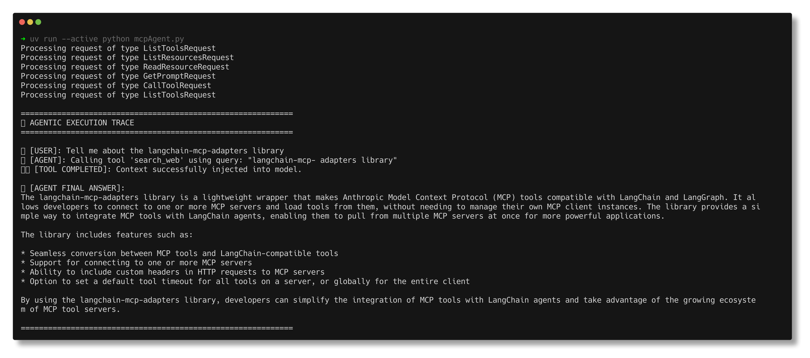
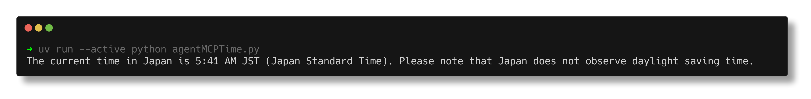
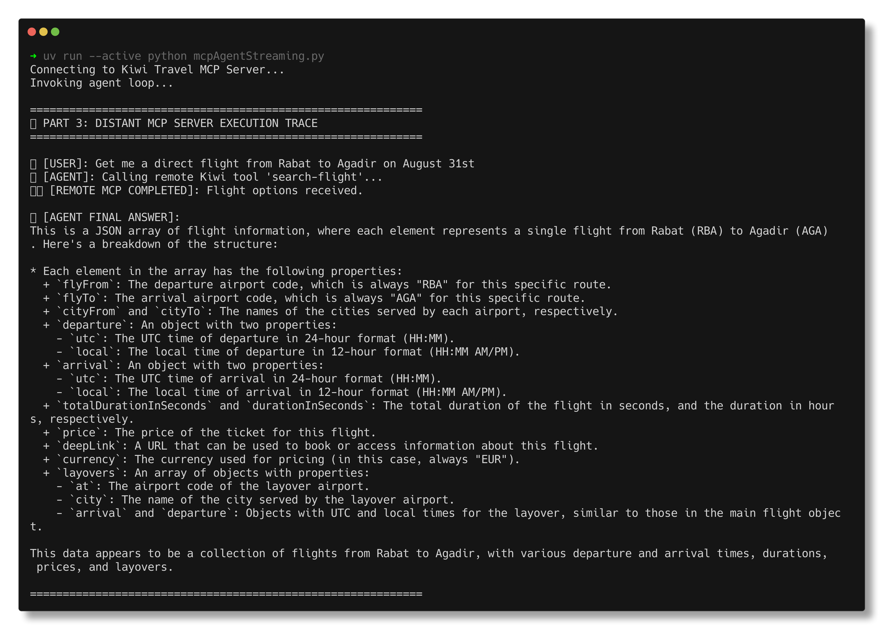

# TP4: Model Context Protocol (MCP) Labs

Ce TP explore l'intégration de serveurs MCP (Model Context Protocol) locaux et distants avec un agent LangChain utilisant un modèle LLM local (Ollama).

---

## 1 - Client MCP Local (stdio)
Exécute un agent connecté à un serveur MCP local (`mcp_local_server.py`) pour effectuer des recherches sur le web via l'outil Tavily.

---

## 2 - Outil MCP de Temps (Time Server)
Exécute un agent connecté à un serveur MCP de temps à la volée via `uvx` pour récupérer l'heure dans une timezone spécifique (ex: Japon).

---

## 3 - Client MCP Distant (HTTP Streaming)
Exécute un agent se connectant à un serveur MCP distant hébergé par Kiwi pour interroger des données réelles de vols de voyage.

