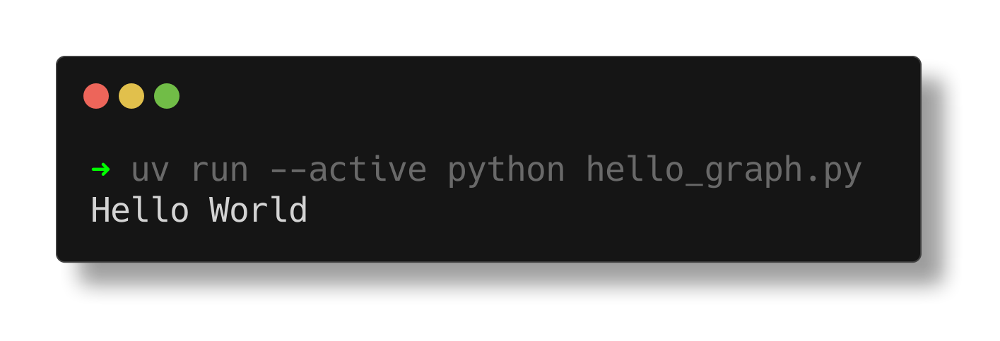
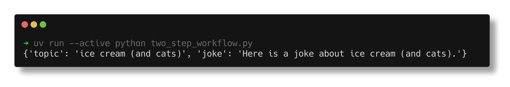
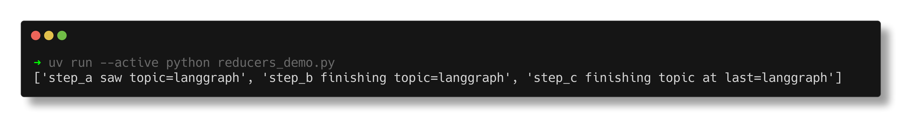
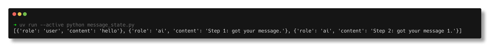
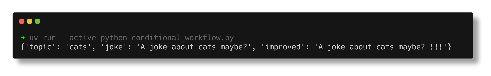
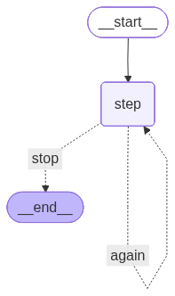
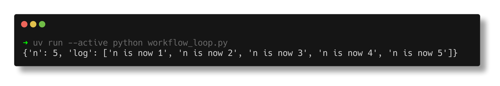

# Lab 8 : Workflow avec LangGraph
---
## Hello Graph

* run `uv run --active python hello_graph.py`

## Two Step Workflow

* run `uv run --active python two_step_workflow.py`

## Reducers Demo

* run `uv run --active python reducers_demo.py`

## Message State

* run `uv run --active python message_state.py`

## Conditional Workflow

* run `uv run --active python conditional_workflow.py`

* result :

## Workflow Loop

* run `uv run --active python workflow_loop.py`

