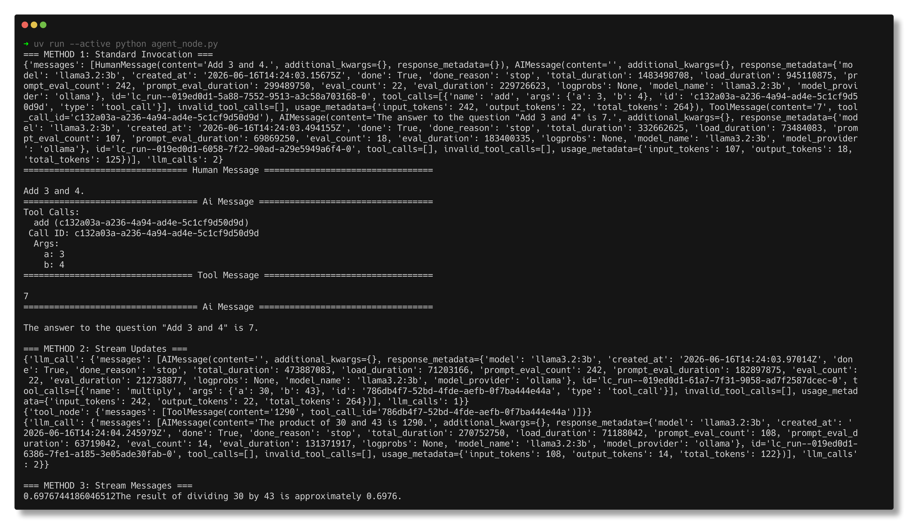
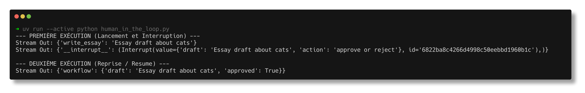
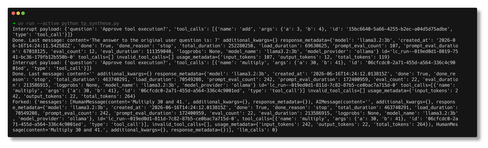

# Lab 9 : Agent avec LangGraph

---
## Agent Node (Partie 1 & Partie 2)

* run `uv run --active python agent_node.py`

## Human in the Loop (Partie 3)

* run `uv run --active python human_in_the_loop.py`

## TP Synthèse (Partie 4)

* run `uv run --active python tp_synthese.py`

