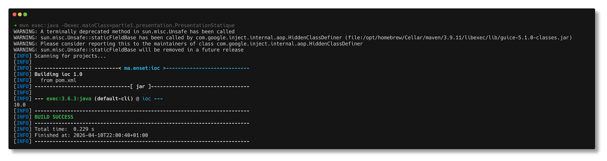
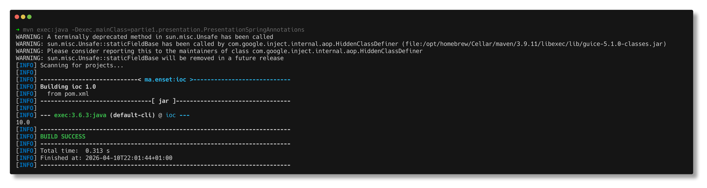
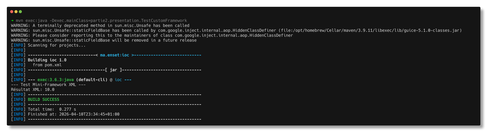

# Rapport de TP : Inversion de Contrôle et Injection de Dépendances

## 1. Introduction
Ce rapport présente la mise en œuvre de l'Inversion de Contrôle (IoC) et de l'Injection de Dépendances (DI) pour garantir un couplage faible entre les composants.

## 2. Partie 1 : Implémentations Standards
### Conception
L'application est basée sur une interface `IDao` pour l'accès aux données et `IMetier` pour la logique métier.

### Méthodes d'injection testées
* **Injection Statique** : Utilisation de l'instanciation directe.
* **Injection Dynamique** : Utilisation de la réflexion Java et d'un fichier `config.txt`.
* **Framework Spring** :
    * Version XML via `ClassPathXmlApplicationContext`.
    * Version Annotations via `@Component` et `@Autowired`.
### Résultats et Captures d'écran:
Les tests suivants valident le bon fonctionnement de l'application. Dans chaque cas, le résultat attendu est 10.0 (2 x 5), car la couche métier multiplie par 2 la valeur retournée par le DAO.
* **Injection Statique** : Instanciation manuelle.
  

* **Injection Dynamique** : Chargement via `config.txt` et l'API Reflection.
  

* **Spring XML** : Configuration via le fichier `spring-ioc.xml`.
  

* **Spring Annotations** : Détection automatique via `@Component` et `@Autowired`.
  

## 3. Partie 2 : Création d'un Mini-Framework IoC

L'objectif de cette partie était de "rentrer sous le capot" pour coder mon propre moteur d'injection de dépendances, un peu comme une version ultra-simplifiée de Spring IoC.

### Approche Technique

Le framework repose sur deux piliers :

1.  **L'API Reflection** : Pour instancier les classes dynamiquement sans utiliser le mot-clé `new` en dur dans le code.
2.  **JAXB (OXM)** : Pour transformer le fichier XML de configuration en objets Java utilisables par le moteur.

### Fonctionnalités implémentées

* **Annotations personnalisées** : J'ai créé `@MyComponent` pour marquer les classes à instancier et `@MyInject` pour identifier où le framework doit injecter les dépendances.
* **Scanner de composants** : Le moteur parcourt les classes fournies et cherche les annotations. Si un champ est annoté `@MyInject`, le moteur cherche une instance compatible dans son contexte et l'injecte via `field.set()`.
* **Support XML (via JAXB)** : Au lieu de parser le XML à la main, j'ai utilisé JAXB pour mapper les balises `<bean>` et `<property>`. Cela permet de charger une architecture complexe juste en modifiant le fichier XML.

### Difficultés rencontrées

Le plus dur a été de gérer la compatibilité entre les vieilles versions de Spring suggérées (3.2.2) et mon environnement Java 21. J'ai eu une erreur `IllegalArgumentException` parce que Spring ne savait pas lire le bytecode trop récent. J'ai dû mettre à jour les dépendances pour que le scan de composants fonctionne enfin.

### Résultat du test custom

Le test valide que mon framework arrive à faire la même chose que Spring :
On voit bien que le résultat `10.0` est obtenu via l'injection par attribut et via le parsing XML de JAXB.

* **My Spring** : Configuration via le fichier `custom-ioc.xml`.
  
-----

## 4\. Conclusion

Ce TP m'a permis de démystifier le fonctionnement des frameworks comme Spring. L'Inversion de Contrôle n'est pas juste un concept théorique, c'est un outil puissant pour rendre le code **"fermé à la modification et ouvert à l'extension"**

En séparant le code métier des aspects techniques (comme la gestion des transactions ou l'instanciation), on obtient une application beaucoup plus facile à maintenir et à faire évoluer dans le temps. Le passage du couplage fort au couplage faible grâce aux interfaces est clairement la clé pour éviter les "cauchemar" de maintenance.
