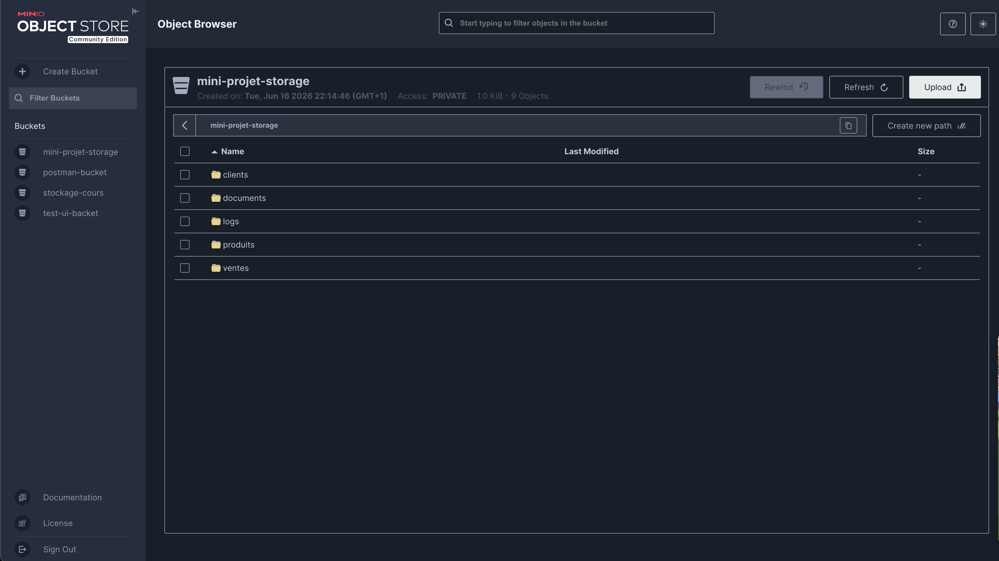
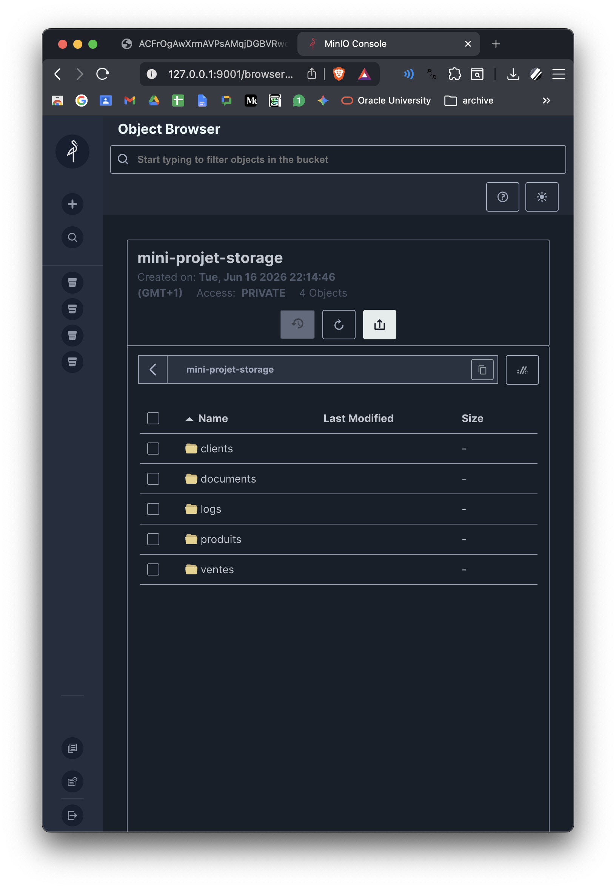
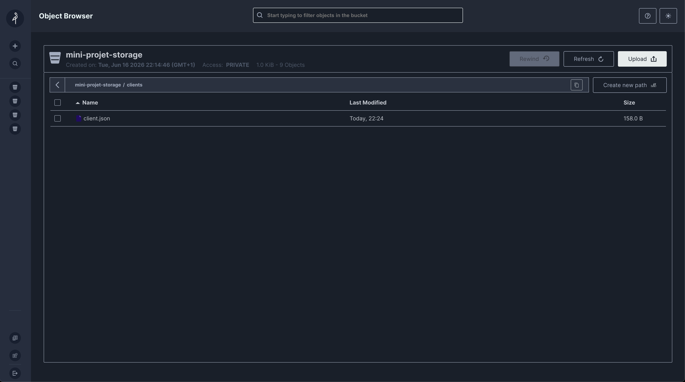
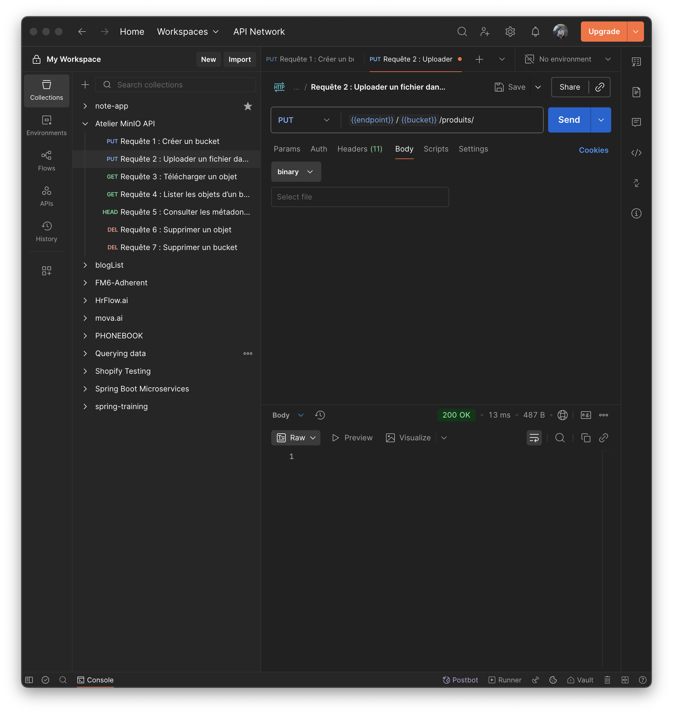
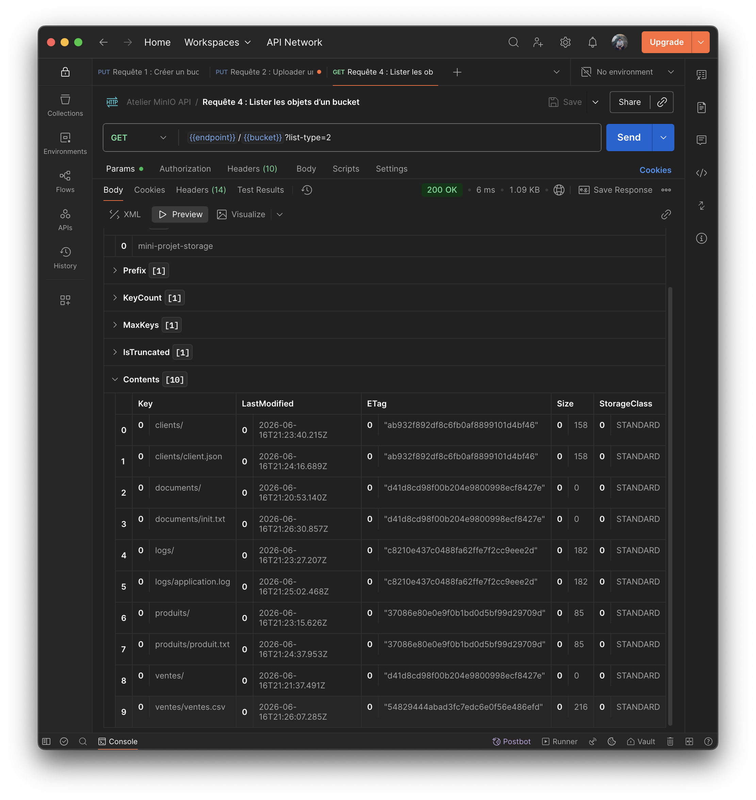
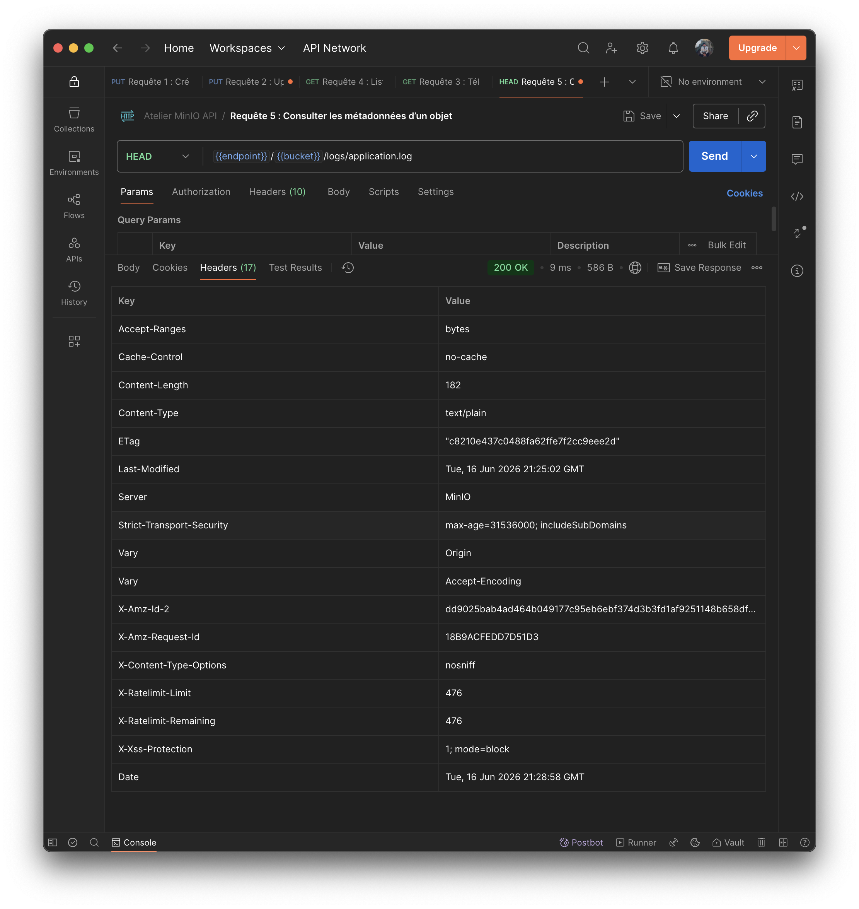
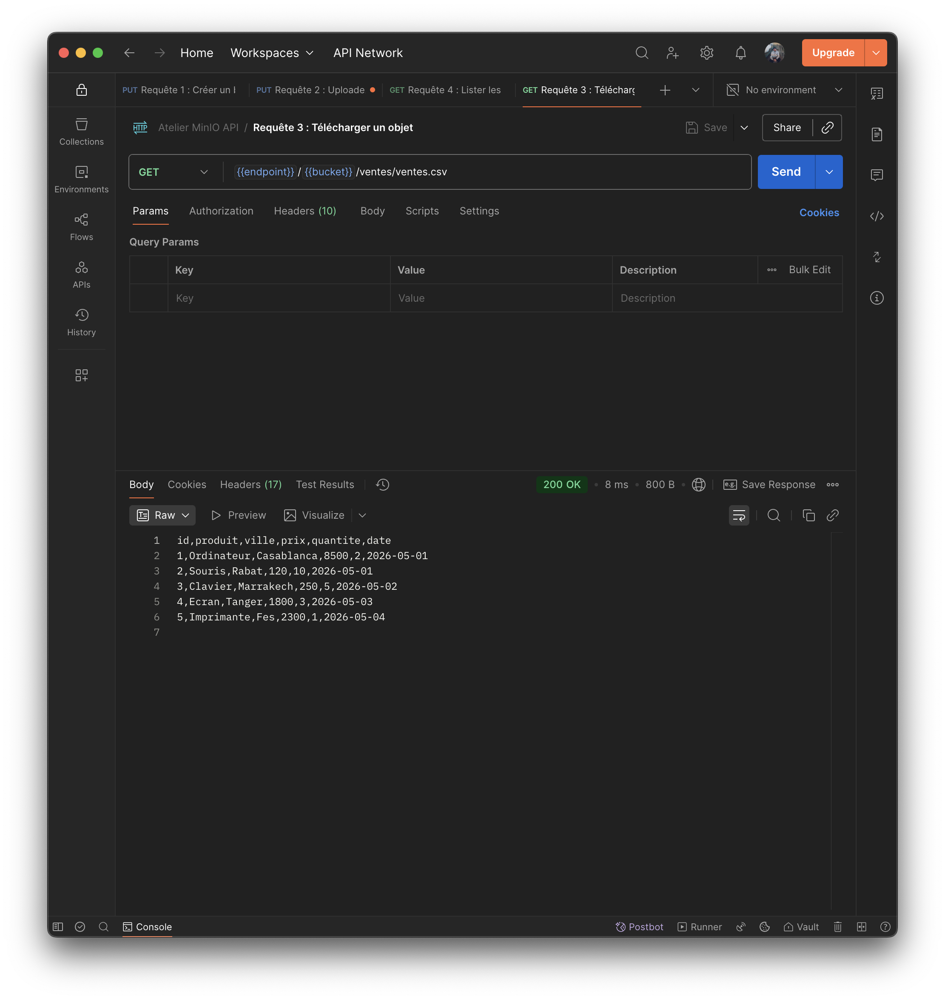
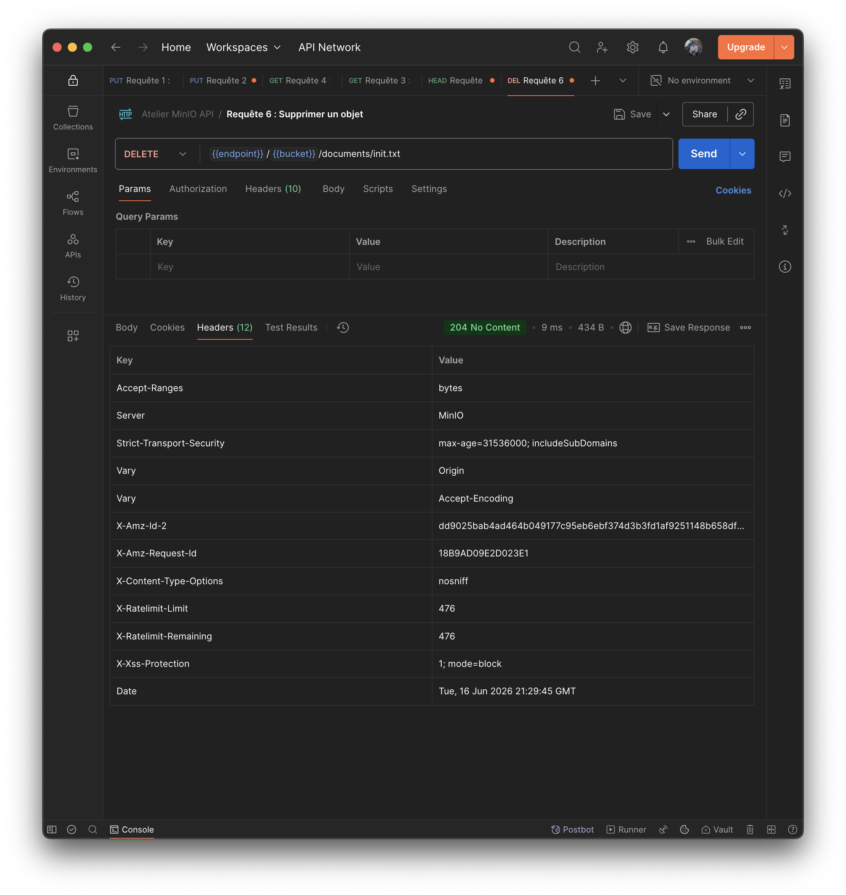
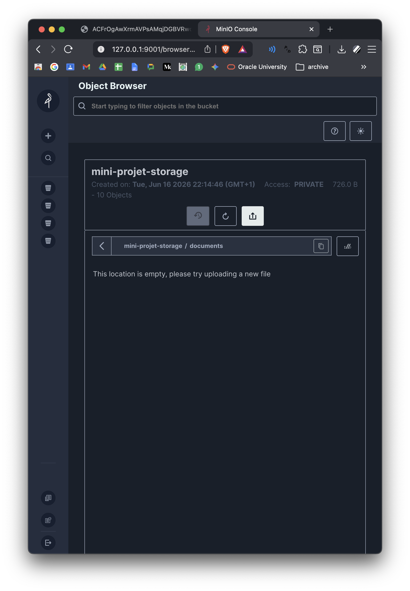

# TP 2: Stockage Objet avec MinIO

---

- Capture de la console MinIO montrant les buckets

- Capture montrant les objets organisés par préfixes

- Captures Postman pour chaque type de requête :

> Requête PUT (ou POST) via Postman pour uploader un fichier et créer un nouveau dossier (préfixe) dans le bucket.

> Requête GET permettant de lister l'ensemble des objets présents à la racine ou dans un préfixe du bucket.

> Requête HEAD utilisée pour récupérer uniquement les métadonnées d'un objet spécifique sans télécharger son contenu.

> Requête GET pour télécharger et lire le contenu d'un objet stocké dans MinIO.

> Requête DELETE envoyée pour supprimer définitivement un objet spécifique du bucket.

> Vérification depuis l'interface graphique de MinIO confirmant que l'objet a bien été supprimé suite à la requête de Postman.

- Le fichier [docker-compose.yml](./docker-compose.yml)

- Conclusion

Cet atelier nous a permis de découvrir et de prendre en main MinIO, une solution de stockage objet hautement performante et 100% compatible avec le standard Amazon S3. Contrairement aux systèmes de fichiers hiérarchiques traditionnels, MinIO repose sur une architecture plate où les données sont encapsulées avec leurs métadonnées au sein de "buckets", facilitant ainsi l'évolutivité massive requise par les architectures Big Data. Le déploiement conteneurisé via Docker a démontré la légèreté et la simplicité de mise en place de la plateforme. De plus, la manipulation directe des objets via Postman a mis en évidence l'approche API-first de MinIO, prouvant qu'il est très facile d'intégrer ce type de stockage cloud-native dans des applications tierces de manière sécurisée. En résumé, MinIO s'impose comme une alternative moderne, flexible et robuste pour la gestion des données non structurées.
