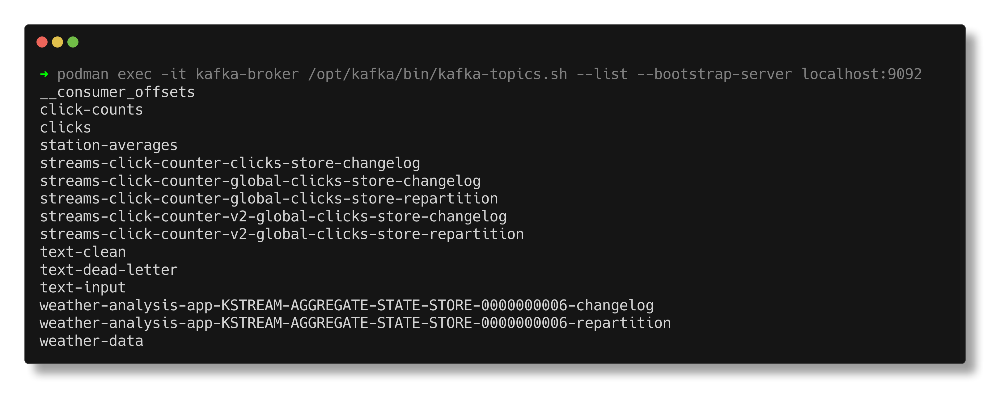
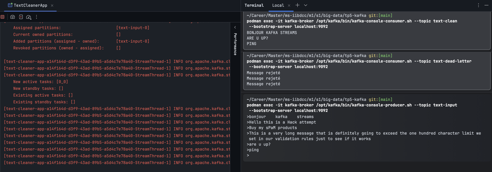
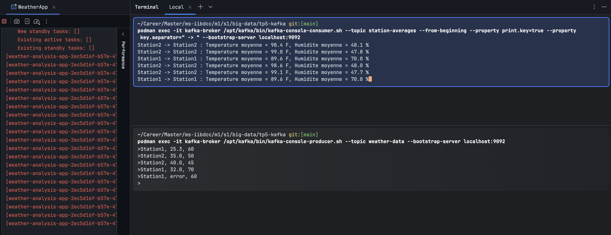
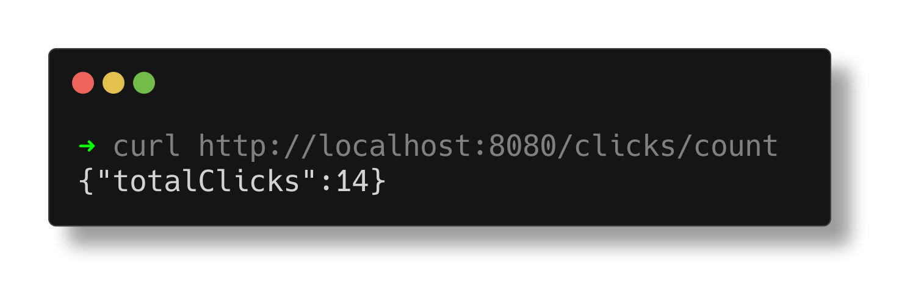

# TP 5 : Traitement de flux avec Kafka Streams
---

### — les commandes utilisées pour créer les topics Kafka ;
```sh
# --- EXERCICE 1 : Nettoyage et routage de texte ---
podman exec -it kafka-broker /opt/kafka/bin/kafka-topics.sh --create --topic text-input --bootstrap-server localhost:9092 --partitions 1 --replication-factor 1
podman exec -it kafka-broker /opt/kafka/bin/kafka-topics.sh --create --topic text-clean --bootstrap-server localhost:9092 --partitions 1 --replication-factor 1
podman exec -it kafka-broker /opt/kafka/bin/kafka-topics.sh --create --topic text-dead-letter --bootstrap-server localhost:9092 --partitions 1 --replication-factor 1

# --- EXERCICE 2 : Analyse de données météorologiques ---
podman exec -it kafka-broker /opt/kafka/bin/kafka-topics.sh --create --topic weather-data --bootstrap-server localhost:9092 --partitions 1 --replication-factor 1
podman exec -it kafka-broker /opt/kafka/bin/kafka-topics.sh --create --topic station-averages --bootstrap-server localhost:9092 --partitions 1 --replication-factor 1

# --- EXERCICE 3 : Comptage de clics (Spring Boot) ---
podman exec -it kafka-broker /opt/kafka/bin/kafka-topics.sh --create --topic clicks --bootstrap-server localhost:9092 --partitions 1 --replication-factor 1
podman exec -it kafka-broker /opt/kafka/bin/kafka-topics.sh --create --topic click-counts --bootstrap-server localhost:9092 --partitions 1 --replication-factor 1
```

### — des captures d’écran montrant :









### 

Franchement, voilà ce que tu peux écrire directement dans ton rapport. J'ai rédigé ça avec un style d'étudiant (clair, simple, sans faire "robot" ou trop formel), comme si tu expliquais ton projet au prof.

---

### — une courte description de l’architecture réalisée ;

Pour ce TP, on a mis en place une architecture de traitement de flux de données en temps réel en utilisant **Apache Kafka** et la dep **Kafka Streams**. L'ensemble du projet fonctionne avec un broker Kafka (lancé sous Podman) et est divisé en trois grandes parties :

1. **Nettoyage et routage de texte (Exercice 1) :** C'est une architecture de filtrage simple. Un flux (`KStream`) écoute un topic d'entrée, applique des transformations de base (suppression des espaces, mise en majuscules) puis utilise des filtres de sécurité pour séparer les messages. Les messages valides vont dans un topic propre et les messages suspects (mots interdits comme SPAM) sont redirigés vers une file d'attente d'erreur (`text-dead-letter`).
2. **Analyse de données météo avec état (Exercice 2) :** Ici, on a implémenté une architecture avec état (`Stateful`). L'application reçoit des données brutes de capteurs, filtre les températures extrêmes, les convertit en Fahrenheit, puis regroupe les données par station. Grâce à une `KTable` et à l'opération `aggregate`, l'application calcule et met à jour une moyenne glissante (température et humidité) en temps réel pour chaque station.
3. **Microservice web et API REST avec Spring Boot (Exercice 3) :** Pour cette partie, on a intégré Kafka dans une vraie application Spring Boot. L'architecture contient 3 composants principaux dans le même code :
* **Un Producteur Web :** Une page HTML stylisée avec Tailwind CSS qui envoie un message dans le topic `clicks` à chaque fois qu'on clique sur un bouton.
* **Un Processeur Streams :** Il récupère les clics, applique une clé globale unique (`totalClicks`) et utilise `.count()` pour calculer le score total. Il envoie le résultat mis à jour dans `click-counts`.
* **Un Consommateur / API REST :** Un listener (`@KafkaListener`) écoute le topic des scores pour mettre à jour une mémoire locale, et un contrôleur expose ce résultat en JSON sur l'endpoint `http://localhost:8080/clicks/count`.


### — une explication des principales difficultés rencontrées et des solutions proposées.

Pendant le développement de ce TP, on a fait face à quelques blocages techniques, voici comment on les a résolus :

* **Difficulté 1 : Formatage du message dans la Dead Letter Queue (Exercice 1)**
* *Problème :* Au début, notre code transférait le message invalide original (par exemple la chaîne avec le mot "SPAM") directement dans le topic de mort. Or, le sujet demandait d'afficher exactement la chaîne `"Message rejeté"`.
* *Solution :* On a corrigé ça en insérant une étape de transformation `.mapValues(value -> "Message rejeté")` juste après le filtre des spams et juste avant la redirection vers le topic final.


* **Difficulté 2 : Latence d'affichage et blocage du consommateur (Exercice 2)**
* *Problème :* Lors des premiers tests de calcul de moyennes météo, on tapait les données dans le producteur mais rien ne s'affichait dans le terminal du consommateur. On pensait que le code avait planté. En fait, c'était à cause du système de cache de Kafka Streams qui attend par défaut 30 secondes avant de pousser les données modifiées.
* *Solution :* Pour le mode de test en local, on a modifié la configuration de l'application dans le code Java en mettant `CACHE_MAX_BYTES_BUFFERING_CONFIG` et `COMMIT_INTERVAL_MS_CONFIG` à `0`. Cela a forcé Kafka à désactiver le cache et à envoyer les calculs de moyennes instantanément après chaque entrée.


* **Difficulté 3 : Conflit d'état et accumulation de clés fantômes (Exercice 3)**
* *Problème :* C'était la plus grande difficulté. Au cours de l'exercice 3, on est passé d'un comptage par utilisateur à un comptage global. Après avoir relancé l'application, le `curl` affichait un JSON bizarre rempli de chiffres répétitifs comme `{"11":11, "12":12}` au lieu de `{"totalClicks": X}`. C'était parce que Kafka stockait encore les anciens états de nos tests précédents dans ses rubriques internes de sauvegarde (*changelogs*).
* *Solution :* Pour nettoyer cette "mémoire fantôme", on a d'abord arrêté l'application, puis on a exécuté des commandes pour supprimer et recréer complètement les topics à blanc. Enfin, on a modifié la propriété `spring.kafka.streams.application-id` dans le fichier `application.properties` en changeant son nom (on a mis `streams-click-counter-v2`). Cela a forcé Kafka Streams à ignorer l'historique et à recréer un espace de stockage tout propre. Après ça, le test `curl` a marché parfaitement.

------

### Exercise 1 
**1. Quel est le rôle du topic text-dead-letter ?**

En fait, c'est un peu comme une poubelle pour les mauvais messages (Dead Letter Queue). Ça sert à mettre de côté tous les messages qui ont des erreurs ou qui sont mal formés pour pas qu'ils fassent planter le reste du programme qui utilise les bonnes données. Comme ça, on peut regarder plus tard pourquoi ça a bloqué.

**2. Pourquoi est-il important de nettoyer les messages avant de les traiter ?**
   
Parce que souvent, les messages qui arrivent au début sont un peu "sales", avec des espaces en trop ou un mélange de majuscules/minuscules. Si on ne nettoie pas d'abord, on risque d'avoir des erreurs ou de rater des trucs quand on va faire les vraies validations après. C'est juste pour être sûr d'avoir des données propres dès le départ.

**3. Pourquoi faut-il convertir le texte en majuscules avant de vérifier les mots interdits ?**
  
C'est pour être sûr de ne rater aucun mot. Par exemple, si on cherche le mot "SPAM" mais que l'utilisateur a écrit "Spam" ou "sPaM", le programme va croire que tout va bien. En mettant tout en majuscules avant de tester, on est sûr de bloquer le mot, peu importe comment il a été tapé.

**4. Comment peut-on améliorer cette application pour gérer une liste de mots interdits stockée dans un fichier ou une BDD ?**

Au lieu d'écrire les mots interdits en dur directement dans le code Java, on pourrait lire la base de données et envoyer ces mots dans un nouveau topic Kafka (par exemple "forbidden-words"). Après, dans Kafka Streams, on peut récupérer ce topic sous forme de KTable. L'avantage c'est qu'on pourrait mettre à jour la liste des mots interdits en direct, sans devoir modifier et recompiler tout le code.


## Exercise 2

**1. Pourquoi doit-on regrouper les données par station avant de calculer les moyennes ?**

En gros, si on veut faire une moyenne pour chaque station météo, il faut d'abord trier les messages pour les rassembler par station. C'est ce que fait le groupByKey. Si on oublie de le faire, Kafka va tout mélanger et on va se retrouver avec une moyenne globale de toutes les stations en même temps, ce qui n'aurait aucun sens.

**2. Quelle est la différence entre KStream et KTable ?**


Pour faire simple :

- Un KStream, c'est comme un historique où chaque message s'ajoute à la suite des autres (comme un flux continu de relevés météo bruts).
  
- Une KTable, c'est plutôt comme une base de données qui se met à jour. Pour une même clé (par exemple, une station météo), elle garde juste la toute dernière valeur et écrase l'ancienne pour avoir la situation actuelle.

**3. Pourquoi le résultat d'une agrégation est-il souvent représenté sous forme de KTable ?**

Parce qu'une moyenne ou un compteur, ça change à chaque fois qu'un nouveau message arrive. Ça ne servirait à rien d'avoir une liste infinie de toutes les moyennes calculées depuis le début. On a juste besoin de connaître le résultat actuel ("à l'instant T"). Et comme la KTable est faite pour stocker un état mis à jour, c'est la structure parfaite pour ça.

**4. Comment gérer un message mal formé comme "Station1, error, 60" ?**

Pour pas que le programme plante complètement à cause d'un problème de conversion (genre essayer de transformer le mot "error" en chiffre), on met le code dans un bloc try-catch. Si une erreur arrive, on l'attrape et on renvoie juste null. Ensuite, on a juste à mettre un petit .filter() derrière pour virer tous les messages null et garder que les données propres pour la suite du traitement.

**5. Pourquoi Kafka Streams est-il adapté à ce type de traitement ?**

C'est vraiment fait pour gérer du temps réel quand on a énormément de données qui arrivent en continu. En plus, la librairie gère toute seule plein de trucs relous comme les pannes ou la répartition de la charge. Les outils comme KStream et KTable rendent le code beaucoup plus facile quand on veut faire des trucs un peu complexes comme des moyennes ou des fenêtres de temps, tout en restant directement dans notre code Java.