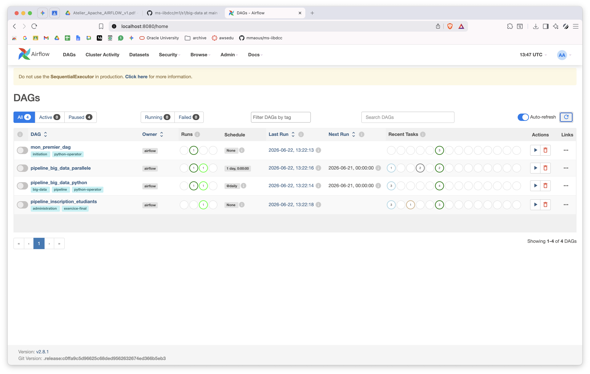
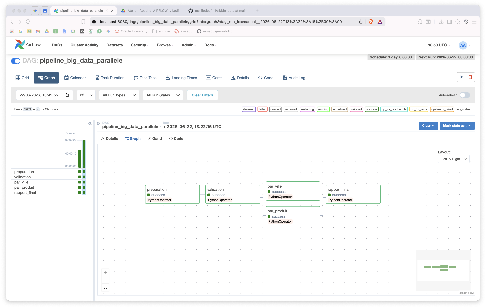
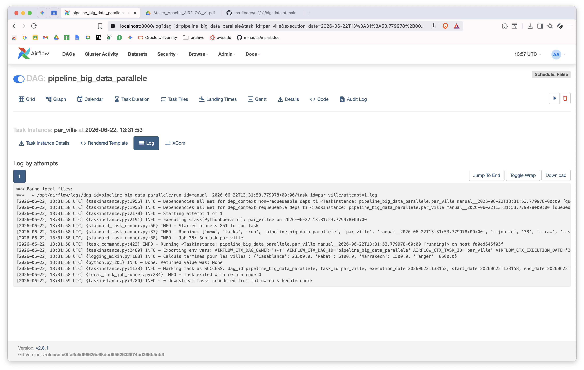

# TP 6: Atelier Big Data Apache Airflow pour l’orchestration des pipelines Big Data
---

### 1. le fichier mon_premier_dag.py: [mon_premier_dag](dags/mon_premier_dag.py)

### 2. le fichier pipeline_big_data_python.py: [pipeline_big_data_python](dags/pipeline_big_data_python.py)

### 3. le fichier pipeline_big_data_parallele.py.py: [pipeline_big_data_parallele.py](dags/pipeline_big_data_parallele.py.py)

### 4. le fichier pipeline_inscription_etudiants.py: [pipeline_inscription_etudiants](dags/pipeline_inscription_etudiants.py)

### 5. une capture de la liste des DAGs dans l’interface Airflow;

### 6. une capture de la vue Graph d’un DAG réussi;

### 7. une capture des logs d’une tâche PythonOperator ;

### 8. une courte réponse aux questions de compréhension.

> #### 6. Deuxième DAG : simulation d’un pipeline Big Data

1. C'est la tâche `ingestion_donnees`. C'est elle qui commence tout en créant le dossier et le fichier CSV avec les données brutes.

2. C'est `generation_rapport`. Elle rassemble tous les résultats à la fin pour en faire un fichier texte facile à lire.

3. Encore `ingestion_donnees`. C'est elle qui s'occupe d'écrire les données de vente dans le fichier `ventes_raw.csv`.

4. C'est `validation_donnees`. En gros, elle regarde si le fichier est bien là et s'il est prêt pour qu'on le transforme.

5. C'est `traitement_analytique`. Elle prend le fichier propre, calcule l'argent gagné pour chaque ville et met les résultats dans un fichier JSON.

6. On peut les trouver directement sur l'interface web d'Airflow. Il faut juste cliquer sur la tâche dans la vue "Graph" ou "Grid", puis cliquer sur le bouton "Log". On y voit les `print` du code Python affichés comme des lignes INFO.

> #### 11 Dépendances parallèles

1. `preparation` (qui crée les données) et `validation` (qui vérifie que le fichier est bien là).

2. Les tâches `par_ville` et `par_produit`. Elles peuvent tourner en même temps parce qu'elles n'ont pas besoin l'une de l'autre pour fonctionner.

3. C'est `rapport_final`. Elle est obligée d'attendre que les deux tâches d'avant finissent avec succès (en statut SUCCESS) avant de pouvoir commencer.

4. On le voit parce que le chemin se sépare en deux. La tâche `validation` pointe avec des flèches vers deux boîtes différentes, l'une au-dessus de l'autre. Après, les deux lignes se rejoignent sur la dernière boîte (`rapport_final`), ce qui donne au dessin un peu la forme d'un losange.
