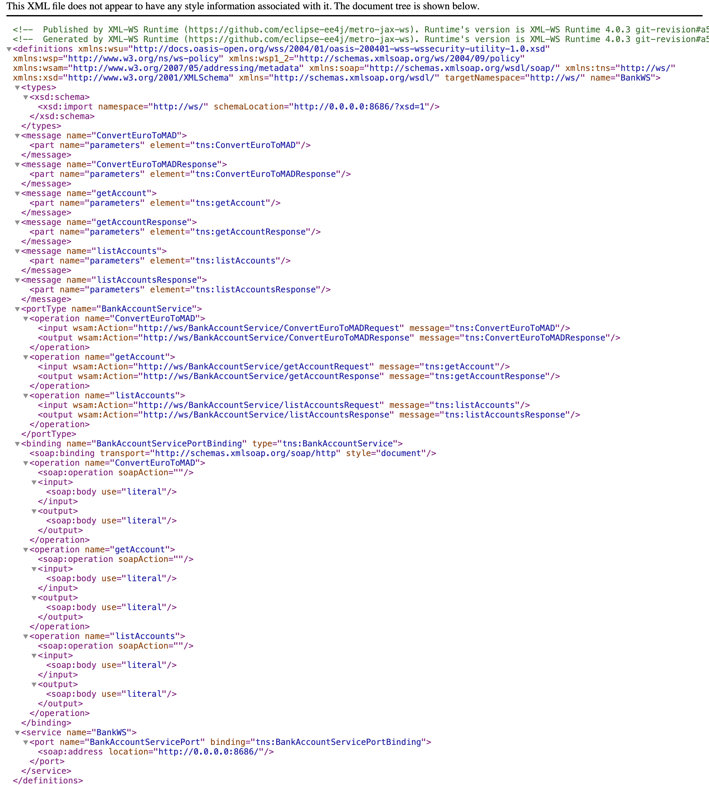
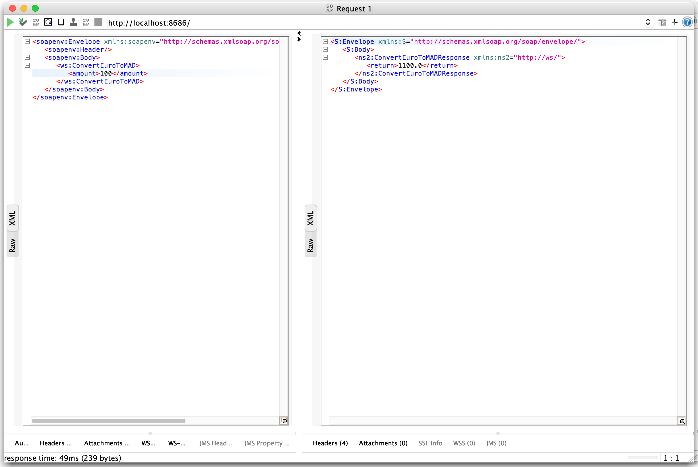
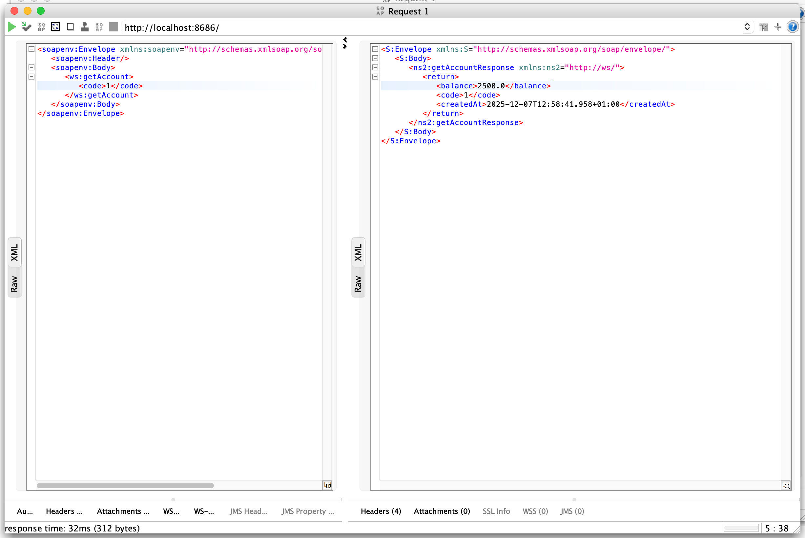
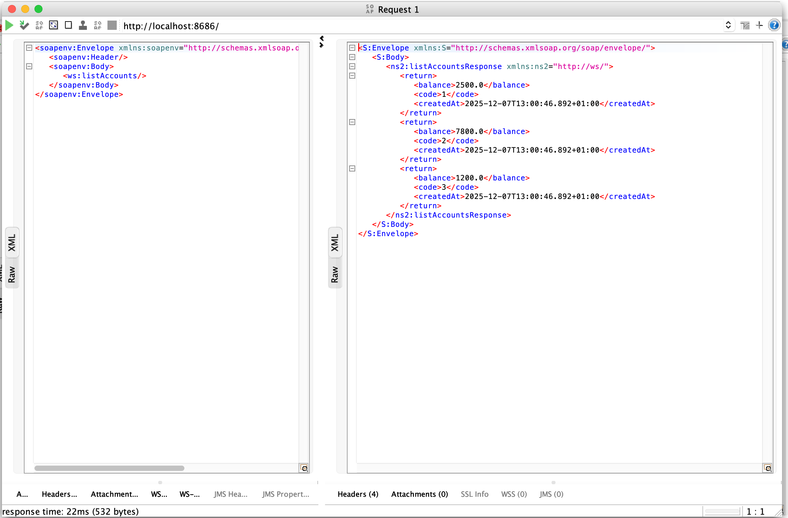
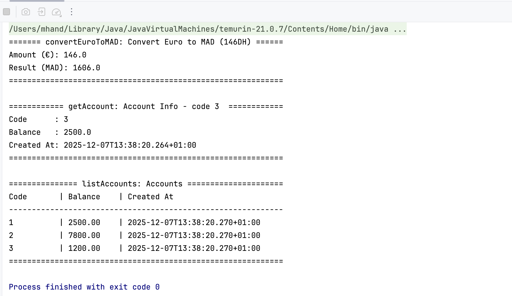

# Activité Pratique N°3- Web services

---

## 1. Web Service Implementation

**Location:** `bank-service/src/main/java/ws/BankAccountService.java`

Operations:

- `convertToMAD(double amount)` → converts Euros to DH (web method name : ConvertEuroToMAD ).
- `getAccount(int code)` → gets a single account by code.  
- `listAccounts()` → returns a list of accounts.

---

## 2. Deployment

- Web service is deployed using jaxws in `WSEntrypoint.java`.  
- Endpoint URL: `http://0.0.0.0:8686/?wsdl`  

---

## 3. WSDL Analysis

The WSDL can be accessed via a browser: `http://localhost:8686/?wsdl`  



---

## 4. Testing with SoapUI

Operations tested:

- **Convert Euro to MAD**



- **Get Account**



- **List Accounts**



---

## 5. SOAP Java Client

**Location:** `soap-client/src/main/java/client/Main.java`  
**Stub generation:** generated classes in `proxy/`.
**Client Output:**



---

## 6. Project Structure
```txt

.
├── captures/
├── bank-service
│   ├── pom.xml
│   └── src/main/java
│       ├── ws
│       │   ├── Account.java
│       │   └── BankAccountService.java
│       └── WSEntrypoint.java          # publishes the SOAP endpoint
│
├── soap-client
│   ├── pom.xml
│   └── src/main/java
│       ├── client/Main.java           # tests all SOAP operations
│       └── proxy/                     # generated classes
│
└── bankWS-soapui-project.xml          # SoapUI project

```
